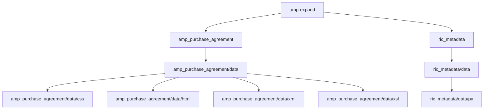

# amp-expand

... expanding the data sets of the [Auden Musulin Papers](https://github.com/Auden-Musulin-Papers) (AMP) edition project.

## Directory Structure

[amp-expand/amp_purchase_agreement/data](https://github.com/timofruehwirth/amp-expand/tree/main/amp_purchase_agreement/data) includes XML, XSLT, XHTML, and CSS code (v1.0.0) of a human-readable and machine-readable diplomatic transcription of W. H. Auden's purchase contract for the property Kirchstetten, Hinterholz 6, dated 1957-10-04.

[amp-expand/ric_metadata/data/py](https://github.com/timofruehwirth/amp-expand/tree/main/ric_metadata/data/py) holds the Python code (v0.1.0) of a script (in development) which reads a human-readable [CSV file](https://github.com/Auden-Musulin-Papers/amp-data/blob/main/data/ric_metadata/ric_metadata.csv) (in develpment) containing metadata of the AMP documents and writes a machine-readable [RDF/XML file](https://github.com/Auden-Musulin-Papers/amp-data/blob/main/data/ric_metadata/ric_metadata.rdf) (in development) that presents them in RiC format.

